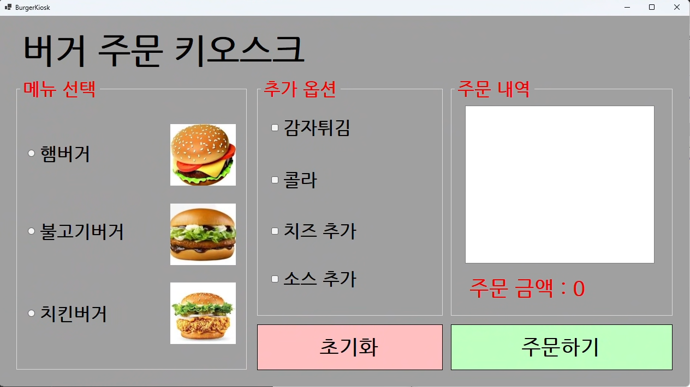

# (C# 코딩) 버거 주문 키오스크

## 개요
- C# 프로그래밍 학습
- 1줄 소개: 버거와 추가옵션을 원하는 대로 주문하는 화면
- 사용한 플랫폼:
  - C#, .NET Windows Forms, Visual Studio, GitHub
- 사용한 컨트롤:
- 사용한 기술과 구현한 기능:

# 각 과제별 실행 화면

## 실행 화면 (과제1)

- 과제 내용
    - 컨트롤 배치와 기본적인 속성 설정
    - 선택한 항목 추출 기능 구현
    - UI 구성과 주문하기, 초기화 버튼의 구현

- 구현 내용과 기능 설명
